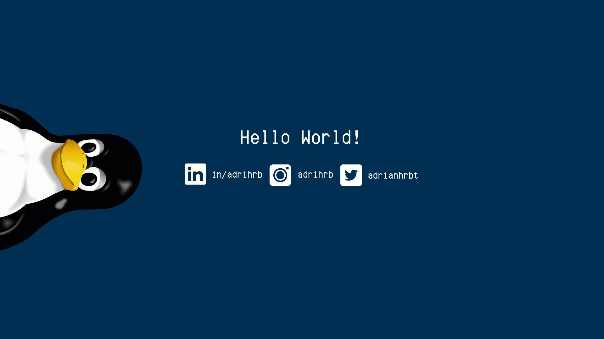

<h1><b>Hey, I'm Adrián! 👋🌍</b></h1>

## **🙋‍♂️ About me:**
- 🌴 Canary Islands
- 📚 Studying software development
- 🌐 Web
- 🏎 I love racing
- 🕹 Sometimes I play videogames
## **🛠 What I am learning:**

 
   
   
  
   
  
   
   

